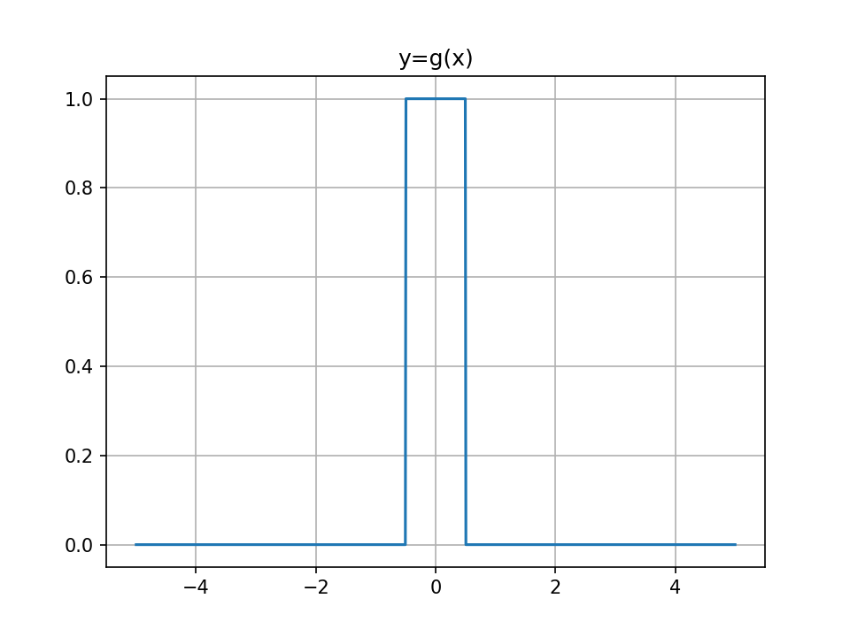
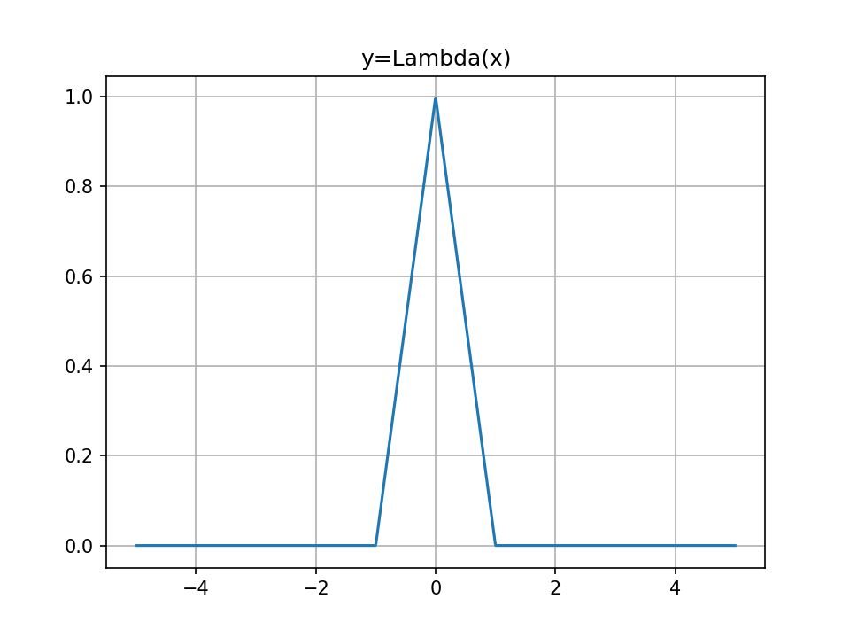
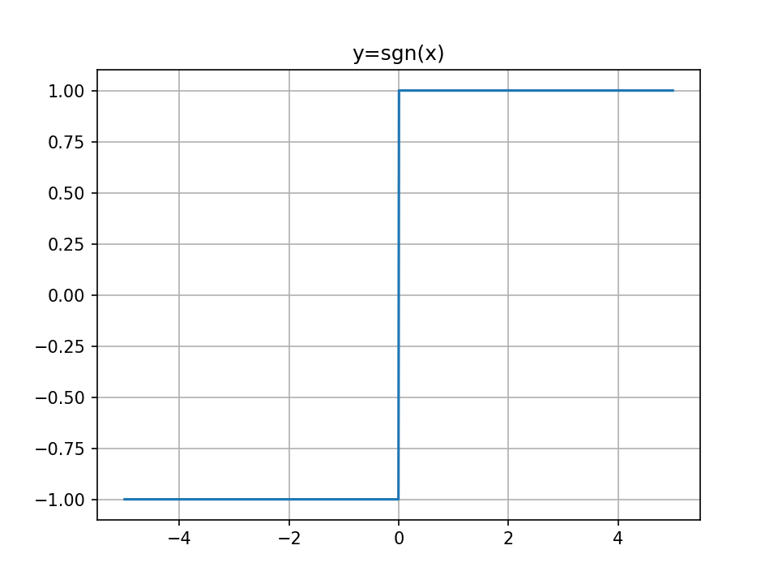
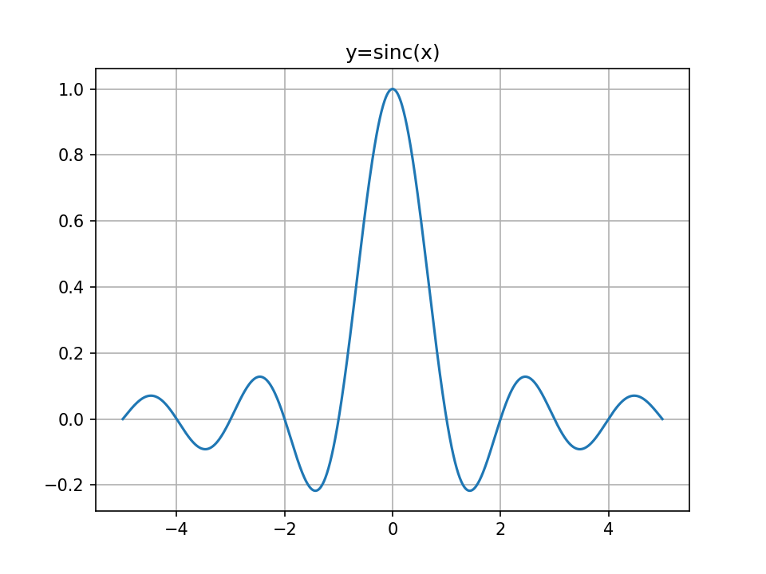
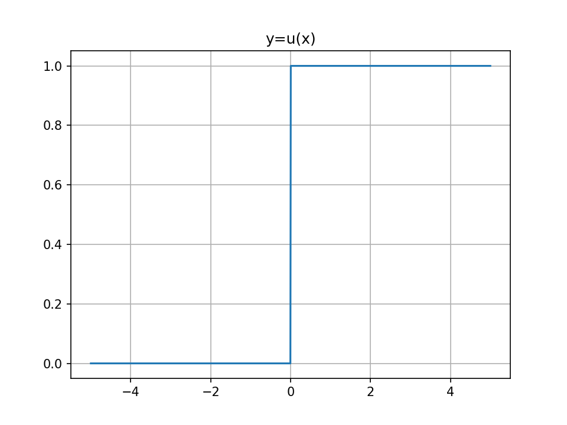

# Chapter 2: Deterministic and random signal analysis

### 1. table of fourier transform properties
| property | signal                                             | fourier transform                                     |
|:--------:|:--------------------------------------------------:|:-----------------------------------------------------:|
| Linearity | $\alpha x_1(t) + \beta x_2(t)$ | $\alpha X_1(f) + \beta X_2(f)$ |
| Duality 对偶性 | $X(t)$ | $x(-f)$ |        
|Conjugacy 共轭 | $x^*(t)$ | $X^*(-f)$ |
|Time-scaling | $x(at)$ | $\frac{1}{\|a\|} X(\frac{f}{a})$ |      
|Time-shift|$x(t-t_0)$|$e^{-j2{\pi}ft_0} X(f)$|
|Modulation|$e^{2{\pi}f_0t} x(t)$|$X(f-f_0)$|   
|Convolution| $x(t) \star y(t)$ | $X(f)Y(f)$|
|Multiplication 乘法|   $x(t)y(t)$| $X(f) \star Y(f)$ |
|Differentiation 微分|  $\frac{d^n}{dt^n} x(t)$|$(j2{\pi}f)^n X(f)$|
|Differentiation in frequency|$t^n x(t)$ | $(\frac{j}{2{\pi}})^n \frac{d^n}{df^n}X(f)$|
|Integration|  $ \int_{-\infty}^{t}x(\tau)\,\mathrm{d}\tau$| $\frac{X(f)}{j2\pi f} \;+\;\tfrac12\,X(0)\,\delta(f)$|
|Parseval's theorem|$\int_{-\infty}^{\infty} x(t)\,y^*(t)\,\mathrm d t =\int_{-\infty}^{\infty} X(f)\,Y^*(f)\,\mathrm d f$|
|Rayleigh's theorem|$\int_{-\infty}^{\infty}\lvert x(t)\rvert^2\,\mathrm d t =\int_{-\infty}^{\infty}\lvert X(f)\rvert^2\,\mathrm d f $|

### 2. signal definitions

### 3. table of fourier transform pairs
|Time domain | Frequency domain|
|:----------:|:---------------:|
|$\delta(t)$|1|
|1|$\delta(f)$|
|$\delta(t-t_0)$|$e^{-j2{\pi}ft_0}$|
|$e^{2{\pi}f_0t}$|$\delta(f-f_0)$|
|$cos(2{\pi}f_0t)$|$\frac{\delta(f-f_0)+\delta(f+f_0)}{2}$|
|$sin(2{\pi}f_0t)$|$\frac{\delta(f-f_0)-\delta(f+f_0)}{2j}$|
|$\Pi(t)$|$sinc(f)$|
|$sinc(t)$|$\Pi(f)$|
|$\Lambda(t)$|$sinc^2(f)$|
|$sinc^2(t)$|$\Lambda(f)$|
|$e^{-\alpha t}u(t), \alpha > 0$|$\frac{1}{\alpha + j2{\pi}f}$|
|$te^{-\alpha t}u(t), \alpha > 0$|$\frac{1}{(\alpha + j2{\pi}f)^2}$|
|$e^{-\alpha \|t\|}$|$\frac{2 \alpha}{\alpha^2 + (2{\pi}f)^2}$|
|$e^{-\pi t^2}$|$e^{-\pi f^2}$|
|$u(t)$|$\frac{1}{j2{\pi}f} + \frac{1}{2}\delta(f)$|
|$sgn(t)$|$\frac{1}{j{\pi}f}$|
|$\delta^{(n)}(t)$|$(j2{\pi}f)^2$|
|$\frac{1}{t}$|$-j \pi sgn(f)$|
|$\sum_{n=-\infty}^{\infty} \delta(t-nT_0)$|$\frac{1}{T_0} \sum_{n=-\infty}^{\infty} \delta(f-\frac{n}{T_0})$|

#### 部分推导
1. 
$$
\begin{align}
    cos(2{\pi}f_0t) & = \frac{e^{j2{\pi}f_0t}+e^{-j2{\pi}f_0t}}{2} \\
    & \Leftrightarrow  \frac{\delta(f-f_0)+\delta(f+f_0)}{2}
\end{align}
$$
2. 
$$
\begin{align}
    \Pi(t) & \Leftrightarrow \int_{-\frac{1}{2}}^{\frac{1}{2}} e^{-j2{\pi}ft}\,\mathrm{d}t \\
    & = \frac{e^{j2{\pi}f} - e^{-j2{\pi}f}}{j2{\pi}f} \\
    & = \frac{sin({\pi}f)}{{\pi}f} \\
    & = sinc(f)
\end{align}
$$
3. 
$$
\begin{align}
    e^{-\alpha t}u(t) & \Leftrightarrow \int_{0}^{\infty} e^{-\alpha t} \cdot e^{-j2{\pi}ft}\,\mathrm{d}t \\
    & = \int_{0}^{\infty} e^{-(\alpha + j2{\pi}f)t}\,\mathrm{d} t \\
    & = \frac{1}{\alpha + j2{\pi}f}
\end{align}
$$
4. 
$$
\begin{align}
    e^{-\alpha |t|} & \Leftrightarrow \int_{0}^{\infty} e^{-\alpha t} \cdot e^{-j2{\pi}ft}\,\mathrm{d}t + \int_{-\infty}^{0} e^{\alpha t} \cdot e^{-j2{\pi}ft}\,\mathrm{d}t \\
    & = \int_{0}^{\infty} e^{-\alpha t}[e^{j2{\pi}ft}+e^{-j2{\pi}ft}]\,\mathrm{d} t \\
    & = 2 \int_{0}^{\infty} e^{-\alpha t} cos(2{\pi}ft)\,\mathrm{d} t \\
    & = \frac{2 \alpha}{\alpha^2 + (2{\pi}f)^2}
\end{align}
$$
> $$ \int_{0}^{\infty} e^{-\alpha t} cos(\beta t)\,\mathrm{d} t = 
\frac{\alpha}{\alpha^2 + \beta^2} $$
5. 
$$
\begin{align}
    e^{-\pi t^2} & \Leftrightarrow \int_{-\infty}^{\infty} e^{-\pi t^2} \cdot e^{-j2{\pi}ft}\,\mathrm{d}t \\
    & =  \int_{-\infty}^{\infty} e^{-(\pi t^2+j2{\pi}ft)} \,\mathrm{d} t \\
    & = \int_{-\infty}^{\infty} e^{-\pi[(t-jf)^2+f^2]} \,\mathrm{d} t \\
    & = e^{-\pi f^2} \int_{-\infty}^{\infty} e^{-\pi(t-jf)^2} \,\mathrm{d} t \\
    & = e^{-\pi f^2}
\end{align}
$$
> $$ \int_{-\infty}^{\infty} e^{-\pi t^2} \,\mathrm{d} t = 1 $$
6. 
$$
\begin{align}
    u(t) & = \int_{-\infty}^{t} \delta(\tau)\,\mathrm{d}\tau \\
    & \Leftrightarrow  \frac{1}{j2{\pi}f} + \frac{1}{2}\delta(f)\\
\end{align}
$$
7. 时域周期采样 $\rightarrow$ 频域周期采样
$$
\begin{align}
 \text{冲激序列} s(t) &= \sum_{n=-\infty}^{\infty} \delta(t-nT_0) \\
 \text{展开为傅里叶级数形式} s(t) &= \sum_{n=-\infty}^{\infty} c_k e^{\frac{j2{\pi}nt}{T_0}} \\
 \text{其中} c_k &= \frac{1}{T_0} \int_{T_0} s(t) e^{\frac{-j2{\pi}nt}{T_0}}\,\mathrm{d}t \\
 & = \frac{1}{T_0} \int_{-T_0/2}^{T_0/2} \sum_{n=-\infty}^{\infty} \delta(t-nT_0) e^{\frac{-j2{\pi}nt}{T_0}}\,\mathrm{d}t \\
 & = \frac{1}{T_0} \\
 \text{因此} s(t) & = \frac{1}{T_0} \sum_{n=-\infty}^{\infty} e^{\frac{j2{\pi}nt}{T_0}} \\
 \text{Fourier transform} S(f) &=  \frac{1}{T_0} \sum_{n=-\infty}^{\infty} \delta(f-\frac{n}{T_0}) \\
\end{align}
$$